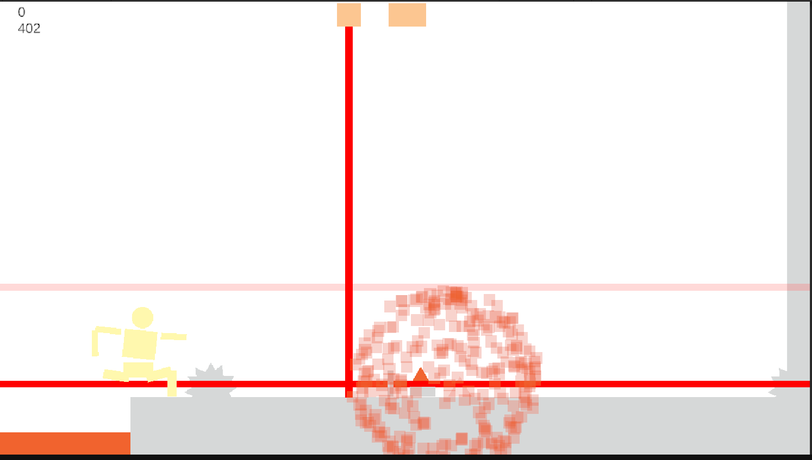

ゲーム制作技術総合実習 個人ワーク
（Circle, Triangle, Squareを使用した2Dゲーム）

# 避けるボーイ

## ゲームの内容
ここにゲームの内容説明を記述する
”避ける”をテーマにしたアクションゲーム
レーザー、爆弾、のこぎり、迫りくる攻撃をよけできるだけ長く生き残れ！
あたってしまうと体分離してしまう。臨機応援に行動しよう！

## 操作説明
例
- 左右矢印キーで移動
- 下矢印でしゃがみ
- 上矢印を振る